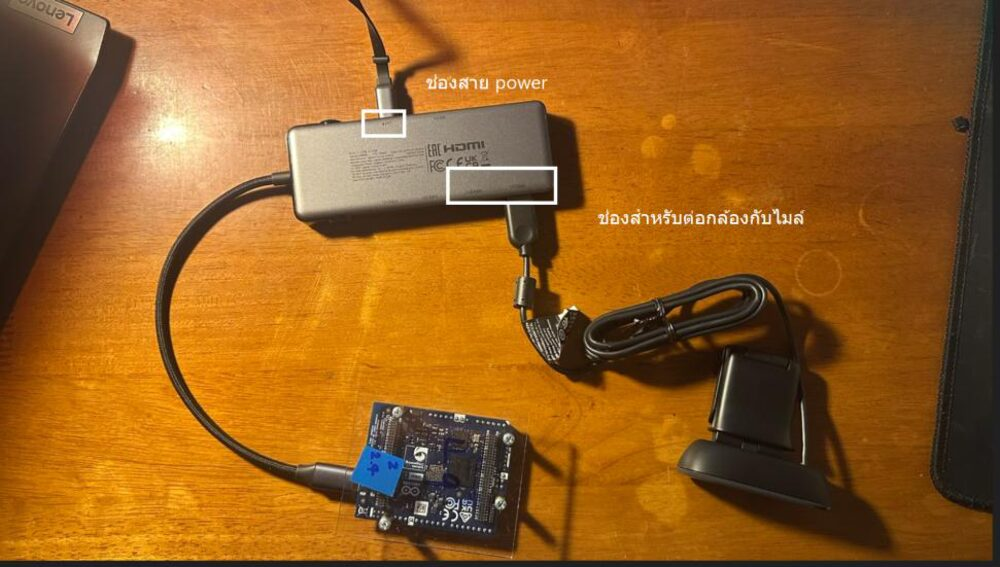

<!-- workshop-header -->

# 🎤 Mic Example — USB Microphone (ฝั่ง Linux)

ไมค์อ่านจาก **ฝั่ง Linux** ของ UNO Q เป็น **Python App** (เหมือนกล้อง ไม่ใช่ Sketch)

เสียบไมค์เข้า powered USB hub (ช่องเดียวกับกล้อง):

---

## วิธีที่ 1 — ใช้ example ของ App Lab (แนะนำ ง่ายสุด)

1. App Lab → **+ New** App → เลือกหมวด **Audio / Microphone** ในตัวอย่าง (Examples)
2. กด **Run** → พูดใส่ไมค์ → เห็น level / waveform ขยับ

## วิธีที่ 2 — รันสคริปต์นี้เอง

1. เสียบ mic เข้า **powered USB hub**
2. เปิด shell (`>_`) สั่ง `arecord -l` → ต้องเห็น card ของไมค์
3. App Lab → New App → ส่วน **Python** → ก็อปโค้ดจาก [mic_check.py](mic_check.py)
4. กด **Run** → พูดใส่ไมค์ 3 วินาที → ได้ไฟล์ `test.wav`
5. ลองเปิดฟัง หรือดูขนาดไฟล์ว่ามีเสียงจริง

> ✅ **ผ่านเมื่อ:** อัดได้ไฟล์ `test.wav` ที่มีเสียงพูด
> 💡 บ่ายนี้: ไมค์ตัวเดียวกันนี้จะเป็น input ของ AI (เช่น แยกคำสั่ง Start / Stop)
